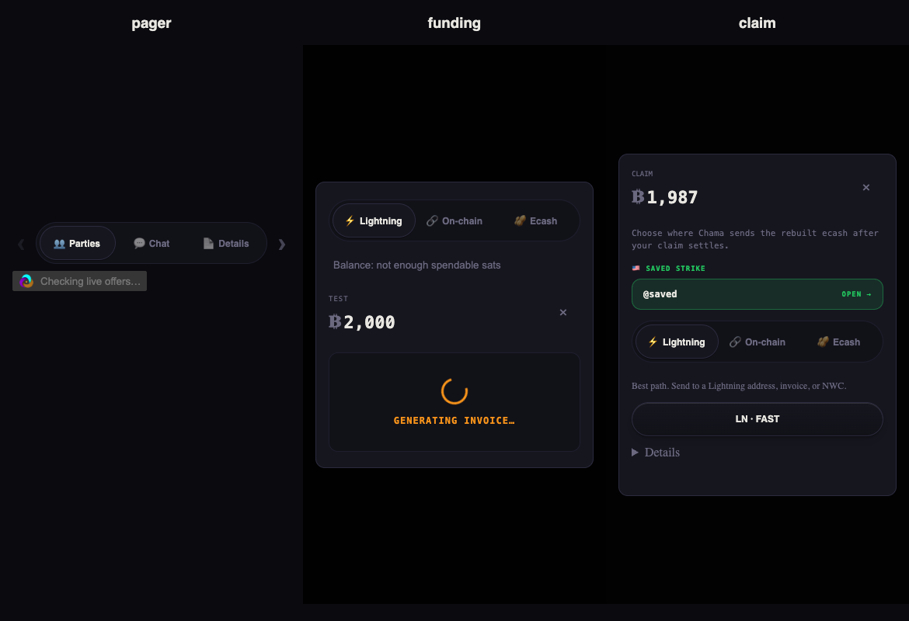
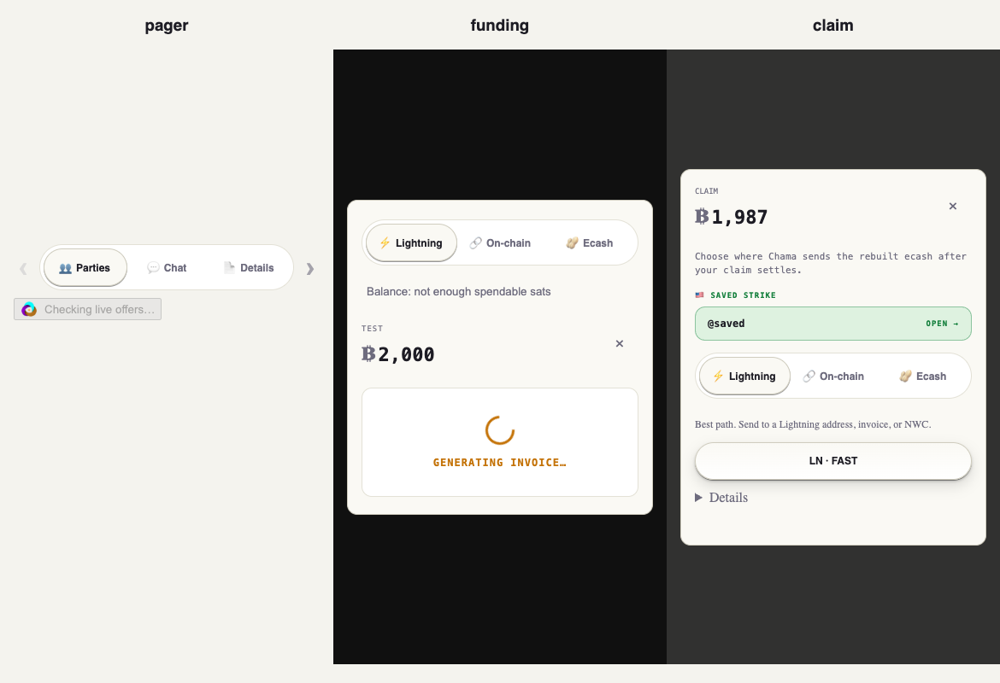

# Brief 11 implementation

## A — vote direction

Both guided vote prompts derive the release destination from `payoutRecipientFor(state, RELEASE)`. The recipient sees “Once {name} confirms, the {amount} come to you”; the other voter sees “Confirm and the {amount} release to {name}.” Names use the shared profile resolver. English, Spanish, French, and Swahili are included. Regression coverage renders all four verticals for both voters.

## B — claim rails

Claim now runs the same gateway-count API as funding. While checking, Lightning and saved Lightning quick-picks are unavailable. Zero gateways disables Lightning with the community-unavailable explanation, opens ecash, and hides saved Strike/NWC and Lightning-dependent cash-out choices. Unknown/failed checks are not presented as zero.

A definite payout failure offers ecash withdrawal on its error screen. This opens the existing wallet export flow, because after a failed Lightning payout the claim may already have been redeemed into the wallet: reconstructing and exporting its old spent escrow note would be wrong. The withdrawal remains an explicit user action. An uncertain/in-flight payout does not offer this shortcut. Existing payout reconciliation and anti-double-pay guards are unchanged.

## C — shared pager appearance

Funding and claim use `PaymentRails`, which uses the same `PagerPills` as the trade view. Icons stay inline in every use; disabling chevrons no longer stacks the icon. The track, 44px buttons, full rounding, highlight, shadow and sliding thumb are shared. Disabled-rail reasons sit below the pills rather than distorting the control.

Each column below is a separately rendered 390px viewport: trade pager, actual funding modal, actual claim modal.

## D — guided loading

The payment-method action contains the 20px ChamaLoader while matching. The results search button uses the same mark; it no longer competes with a large results-area loader. The component uses the app's existing animated/static reduced-motion rules. The mark disappears when matching finishes.

## E — names

The new explicit per-identity `chama_fetch_kind0_enabled_v3` preference defaults on when absent; toggling writes `1` or `0`. Earlier defaults cannot reliably prove a deliberate opt-out, so the new version does not inherit an old implicit off. A new explicit opt-out remains scoped and clears fetched names as before.

Room strips, arbiter records and trade cards already used the shared resolver. Guided offer reviews/market matches and attention cards now receive the same profile map instead of forcing generated names or shortened keys. Profile lookup includes public offers, not just the user's trades. Notification copy identifies the trade and role rather than rendering a separate counterparty pseudonym. Generated fallback names use a deterministic hash of the normalized pubkey; the same key and language produce the same name on two devices. Actual name availability still depends on receiving that key's profile from relays.

## F — private payment instructions

A collapsed “How to pay {name}” row appears in a LOCKED guided room for seated participants only. It uses the existing handle display function, shows the rail and network labels, and offers copy. The payee name comes from the locker/refund recipient. Unseated viewers receive no handle markup; regression tests assert that explicitly.

## G — payment preferences and storage

Guided method choices now persist in the user-scoped `chama_preferred_payment_rails_v1` key. Changing verticals restores that selection; each question intersects it with its available rails, so an irrelevant method is never offered. Saved payment details remain one list across verticals.

The brief's raw-key finding was already addressed in this checkout: saved-handles reads/writes use `getScopedStorageItem`/`setScopedStorageItem`. No second migration was added. Tests verify that a legacy handle moves once to the first active identity, remains available after switching back, and is absent for a second identity. Method preferences have the same identity isolation.

## Verification and limits

Passed: typecheck, full npm test suite, build, repository hygiene, existing payment-card browser checks, funding-rail outage/guard checks, guided Exchange checks, and the new dark/light 390px comparison and zero-gateway claim checks. New unit coverage includes all eight voter/vertical combinations, private handle visibility, name defaults/opt-out, deterministic fallback, handle migration, and method persistence/isolation.

Brief 11 records Jet's successful real 1,212-sat Bill Pay ecash lifecycle on the prior commit. This task has not repeated Jet's two-browser real-federation run. The browser fixtures use application components and test actions; they do not establish a new real-money settlement. Nothing was released or deployed.
