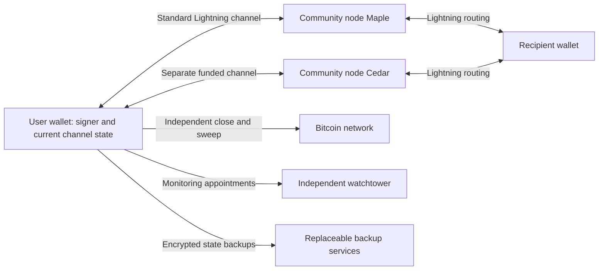

# Community services, individual custody

Working proposal · 2026-09-10 · no production implementation yet

## 1. Translate sovereignty into a requirement

The user's starting point is Fedimint's balance of community trust, privacy, and
easy guardian operation. The proposed stronger requirement is:

> After a payment has fully settled, each recipient controls the resulting claim
> and retains a Bitcoin-enforceable exit that needs no new operator signature.

This is a working interpretation of “sovereignty over every sat.” It means
authority over value, not tracking individually identified satoshis. It does not
mean instant or free exits. A one-sat balance cannot have a universally economical
independent on-chain recovery under arbitrary fees. The wallet must distinguish
the gross claim, presently spendable amount, and estimated net exit proceeds.

Ordinary Fedimint deposits are held by a guardian multisig. A quorum controls
redemption; distributing custody does not give each ecash holder an independent
Bitcoin spending path. [Fedimint architecture](https://fedimint.org/guardians/how-federations-work)

Cashu also has standalone mint implementations: Nutshell, mintd and Nutmix. Its
availability is not limited to LNbits. Operator usability is still a valid product
target, but “there is no node software” is not an accurate premise.
[Cashu mint implementations](https://docs.cashu.space/mints)

## 2. Choose the tradeoff honestly

| Approach | Who authorizes recovery? | Main advantage | Main compromise |
|---|---|---|---|
| Fedimint | Guardian threshold | Private ecash with distributed custody | No unilateral redemption if the quorum refuses |
| Ordinary Cashu mint | Mint operator | Simple bearer ecash | Mint custody and availability |
| Proposed community Lightning product | User's valid channel state and keys, enforced on-chain | Independent exit; existing payment rail | Monitoring, state safety, liquidity, fees; weaker privacy than ecash |
| Ark family, possible future research | User-held transaction path, subject to the selected design | Shared funding and off-chain transfers | Expiry/refresh, operator and exit assumptions need implementation-specific review |

The first two rows follow their published custody descriptions.
[Fedimint](https://fedimint.org/users/how-it-works), [Cashu](https://cashu.space/)
Lightning has cross-signed commitments and unilateral close procedures.
[BOLT 5](https://github.com/lightning/bolts/blob/master/05-onchain.md)
Ark's introductory VTXO design includes exit transactions and expiry/refresh;
its illustrative timelocks must not be generalized to every implementation.
[Ark VTXOs](https://ark-protocol.org/intro/vtxos/index.html)

Recommendation: use Lightning for the first real experiment, preserving standard
channel mechanics. Explore Ark separately if shared funding becomes essential.
This recommendation is an engineering judgment, not a claim of new protocol
research or superiority on every dimension.

## 3. Architecture

The wallet runs a genuine Lightning state machine with user-controlled signing.
A candidate foundation is LDK/LDK Node; LDK exposes persistence, chain sourcing,
networking and key-management integration points. Integration is future work.
[LDK documentation](https://lightningdevkit.org/)

Each community operator runs its own standard Lightning node and commits its own
liquidity. Core Lightning is one candidate with documented plugins, channel
management, backups and monitoring. No changes to its channel signature scheme
are proposed. [Core Lightning docs](https://docs.corelightning.org/docs/home)

Operators may cooperate on directory entries and support, but the directory has
no spending authority. There is no federation-wide pooled user balance. Being an
operator does not grant access to user seeds. A common UI is not a BFT protocol.

Redundancy requires separate usable channels and liquidity. Cedar cannot spend,
move or immediately replace Alice's balance trapped in a Maple channel. Payment
routing through another operator works only where sufficient routes and capacity
already exist. Switching providers may require on-chain settlement and fees.

## 4. Product experience

**Wallet:** join a community using a QR invitation; verify operator identities and
terms; choose channel funding; receive/pay using Lightning invoices; show the
current route capacity. A recovery screen reports whether current state is
available, monitoring is healthy, and an exit is economically plausible. It must
not label a seed backup alone as sufficient channel recovery.

**Community node app:** install a node package, connect a Bitcoin backend, create
the operator wallet, fund liquidity, publish an invitation, and see channel health,
fees and backup status. Use clear operator-owned liquidity limits. Installation
and upgrades should be signed and reproducible; avoid remote scripts with broad
privileges. A friendly setup wizard does not eliminate uptime and capital needs.

**Exit:** show an estimate with explicit assumptions, broadcast through an
independent Bitcoin connection, display actual transaction confirmation and CSV
maturity, then sweep. No operator login or community-directory access may be
required. “Broadcast” and “recovered” must be distinct statuses.

**Recovery rehearsal:** a regtest exercise restores actual current state on a
clean client, disconnects every community service, and claims confirmed outputs.
A green indicator must be grounded in this kind of evidence, not a boolean stored
by an operator.

## 5. Guarantees and responsibilities

| Failure | Intended behavior | Remaining assumption |
|---|---|---|
| One operator offline | Use another funded route or exit affected channel | Alternate capacity or chain access |
| Every operator offline | New routed payments may stop; independent close remains | Current state, keys, fees and Bitcoin liveness |
| Operators collude | They cannot authorize a new user spend alone | Correct channel protocol and uncompromised client |
| Counterparty broadcasts revoked state | Client/tower responds inside the applicable window | Reliable monitoring and timely inclusion |
| User restores stale state | Halt unsafe broadcasting and follow implementation recovery procedures | Seed alone may not restore channels independently |
| Liquidity depleted | Reject before displaying settlement | Routing/funding may need time and cost |
| Fees spike | Reestimate exit; tiny claims may be uneconomic | No universal net-value guarantee |
| Backup provider disappears | Recover using a current independent copy | Copies and decryption keys actually exist |
| Wallet compromise | Attacker may spend user funds | Endpoint security is still essential |

The monitoring, revoked-state and unilateral-close constraints are covered in
[BOLT 5](https://github.com/lightning/bolts/blob/master/05-onchain.md). They are not
implemented in this lab. A community-wide outage must not also disable every
monitor and every Bitcoin data source: use independent infrastructure where
possible. Monitoring services do not automatically provide full wallet recovery.

Lightning privacy is not ecash privacy. A direct community peer sees channel and
adjacent payment activity, and backups/network metadata can leak information.
Tor and careful logging may reduce exposure but do not reproduce blind issuance.
The simulator has no privacy at all.

## 6. Why a refund timeout does not turn ecash into self-custody

Consider Alice depositing bitcoin, getting ecash, and spending it to Bob. If Alice
keeps an independently executable refund for the original deposit, she may later
claim the backing even though Bob now owns the ecash. Resolving that conflict needs
a Bitcoin-enforceable ownership update or a different construction with explicit
assumptions. Merely attaching a timeout or publishing a Merkle root is insufficient.

Likewise, a reserve report does not itself prove all liabilities or enforce each
holder's right to redeem. The design must bind the recipient's current entitlement
to an enforceable exit, prevent conflicting claims, and describe data availability.
No such new private ecash construction is claimed here.

If community custody is acceptable, a different product is plausible: a Fedimint
wallet with user-set ecash exposure limits, explicit custody transitions and
sweeping to a self-custodial wallet when redemption is available. This limits
exposure; it does not make the remaining ecash sovereign or permit sweeps during
a guardian outage. It is excluded from the strict interpretation of this design.

## 7. First real implementation milestone

The completed artifact in this folder is the accounting simulator. Next is a
local regtest harness, not a mainnet launch:

1. Pin and inspect a maintained wallet/node stack; build two user clients, two
   operator nodes and an independent Bitcoin Core node.
2. Fund actual channels with regtest coins; persist the wallet/node state using
   the implementation's required write ordering and backup mechanism.
3. Pay between users. Verify the receiver's settled state and sender debit from
   the real nodes, including fees and restart behavior.
4. Stop both operators. With a real user client, broadcast its current commitment,
   mine through the applicable delays, sweep, and verify the final UTXO with Core.
5. Repeat after a clean client restore; test in-flight HTLC interruption, revoked
   state, insufficient fees, dust, stale backups, reorgs and dropped messages.
6. Add the guardian-style operator UI and wallet only after these paths work.

Acceptance requires real transaction IDs, decoded spending paths, exact before/
after balances, durable state evidence and reproducible failure traces. No Python
balance transfer or simulated version counter meets this gate. Later signet use,
independent security review, and operational recovery drills would precede any
decision about real-value deployment.

## 8. What the current tests establish

Successful simulated transfers conserve value; retries do not pay twice; failed
routes do not mutate balances; inbound and outbound liquidity matter; closing
channels reject payments; synthetic time gates claims; and an offline operator
does not block the model's exit operation. Randomized payment sequences check
accounting over both successful and rejected transfers.

The model deliberately refuses stale-state exits and uneconomic claims rather
than claiming those problems are solved. It contains no real cryptographic,
distributed-systems, Bitcoin or Lightning implementation. These tests validate
the proposed accounting rules, not the safety of a future financial product.
